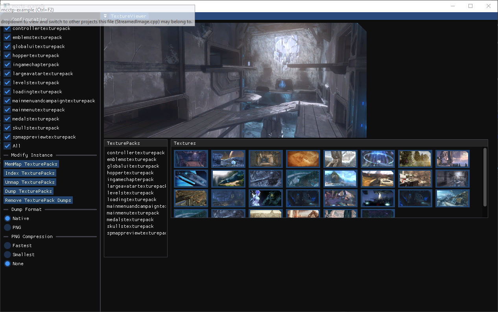

<h1>
  

    

      
      MCC Texture Pack Lib &nbsp &nbsp &nbsp &nbsp &nbsp &nbsp &nbsp &nbsp &nbsp &nbsp 
    

  

</h1>

  
    
    
  

## Features
- Texture Pack Dumping
- Texture Pack Patching
- Texture Atlas Generation
- Texture Mipmap Generation

Inspired by [@Lord-Zedd](https://github.com/Lord-Zedd)'s [MCCTexturePackDumper](https://github.com/Lord-Zedd/MCCTexturePackDumper)
